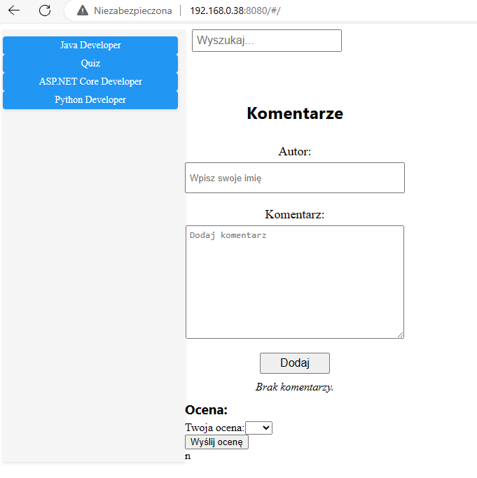
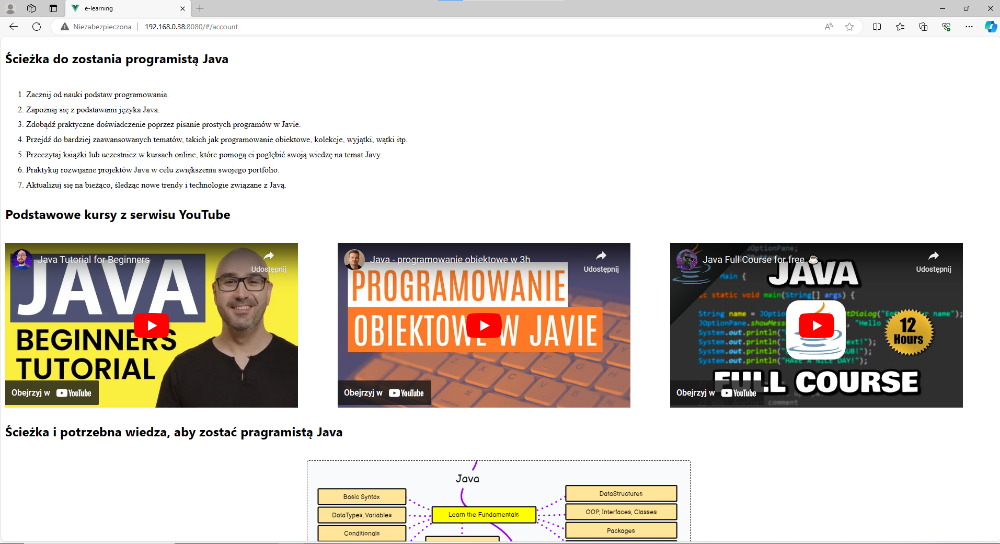
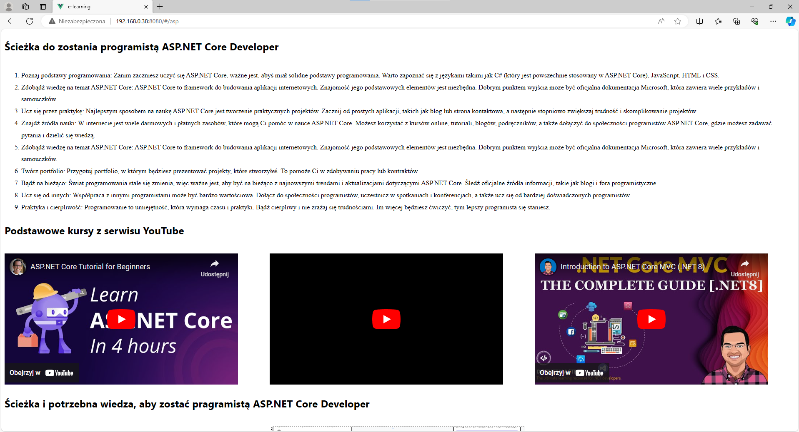
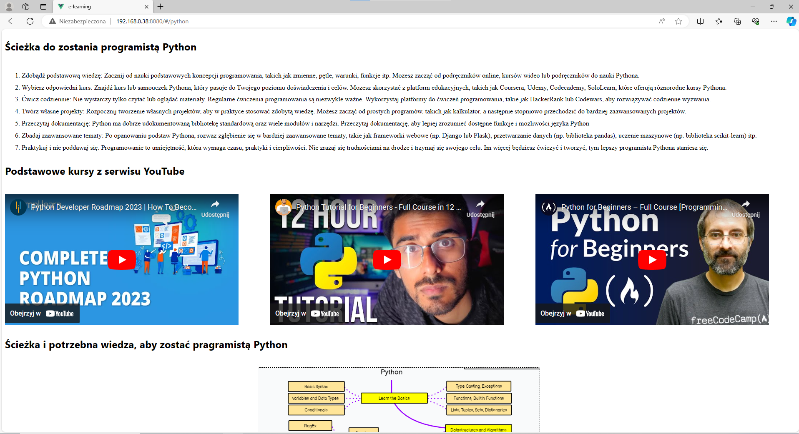
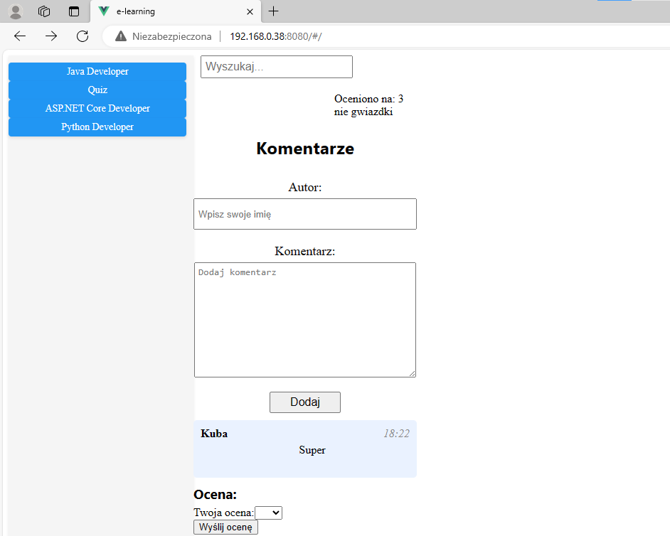

# E-Learningowy Serwis do Nauki Języków Programowania

> To e-learningowy serwis stworzony z myślą o początkujących, którzy chcą nauczyć się programowania w językach Python, Java oraz ASP.NET.

## Spis Treści
* [Informacje Ogólne](#informacje-ogólne)
* [Technologie Użyte](#technologie-użyte)
* [Funkcjonalności](#funkcjonalności)
* [Zrzuty Ekranu](#zrzuty-ekranu)
* [Instalacja](#instalacja)
* [Jak Korzystać](#jak-korzystać)
* [Status Projektu](#status-projektu)
* [Obszary do Rozwoju](#obszary-do-rozwoju)
* [Podziękowania](#podziękowania)
* [Kontakt](#kontakt)

## Informacje Ogólne
- Celem tego projektu jest zapewnienie platformy e-learningowej, która umożliwia łatwą i interaktywną naukę programowania.
- Serwis został zainspirowany portalem e-learningowym Porzuczek.
- Głównym zadaniem jest uproszczenie procesu nauki programowania dla początkujących.
- Projekt jest realizowany z pasji do edukacji i technologii.

## Technologie Użyte
- Vue.js - wersja 2.6
- JavaScript
- HTML
- CSS

## Funkcjonalności
- Ścieżki nauki dla trzech języków programowania: Python, Java, ASP.NET.
- Interaktywne kursy z wykorzystaniem materiałów wideo.
- System komentarzy dla użytkowników.
- Wbudowany system ocen i komentarzy.
- Personalizacja ścieżek nauki.

## Zrzuty Ekranu

**Strona główna**

**Kurs Java**

**Kurs ASP.net**

**Kurs Python**

**Dodawanie komentarzy i ocen**

## Instalacja
Aby uruchomić projekt lokalnie, wykonaj następujące kroki:
1. Sklonuj repozytorium projektu na swój lokalny dysk.
2. Otwórz folder projektu w Visual Studio Code.
3. W terminalu VSCode wpisz `npm install`, aby zainstalować wszystkie zależności.
4. Po zakończeniu instalacji wpisz `npm run serve`, aby uruchomić serwer deweloperski.
5. Otwórz przeglądarkę i przejdź pod adres `http://localhost:8080`.

## Jak Korzystać
- Korzystaj z paska nawigacyjnego po prawej stronie ekranu, aby poruszać się po serwisie.
- Wybierz interesujący Cię kurs z listy dostępnych kursów.
- Śledź instrukcje i materiały kursowe, aby nauczyć się nowych umiejętności programistycznych.

## Status Projektu
Projekt jest w trakcie rozwoju.

## Obszary do Rozwoju
- Połączenie z bazą danych dla lepszego zarządzania treścią.
- Ulepszenie interfejsu użytkownika i doświadczeń użytkowników.
- Dodanie dodatkowych języków programowania i kursów.

Do zrobienia:
- Integracja z bazą danych.
- Przebudowa interfejsu użytkownika.

## Podziękowania
- Projekt zainspirowany przez portal Porzuczek.
- Dziękujemy wszystkim, którzy przyczynili się do rozwoju tego projektu.

## Kontakt
Stworzone przez [@Pawni](https://github.com/Pawgni)
                [@DawidKrejer](https://github.com/DawidKrejer
